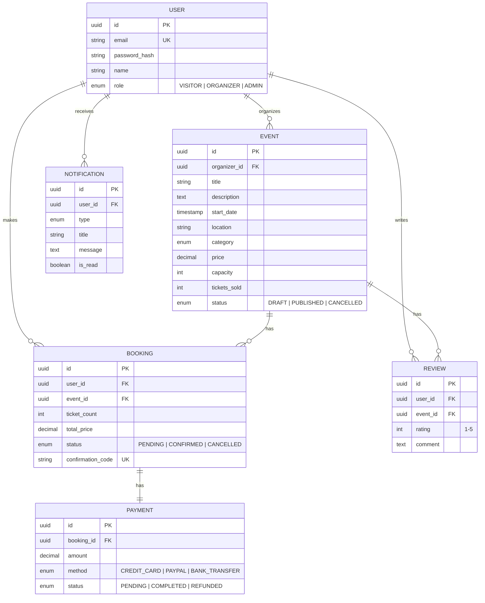

# 🎪 EventHub Mockup

> Digitale Plattform für regionale Veranstaltungen der RheinMain Veranstaltungsgenossenschaft eG (fiktiv)

[](https://github.com/PaulWeber-co/EventHub-Mockup/actions)

---

## 📋 Überblick

**EventHub** verbindet Veranstalter und Besucher auf einer gemeinsamen Plattform. Veranstalter können Events anlegen und verwalten, Besucher können Events finden, Tickets buchen und bezahlen.

### Features

| Feature | Status |
|---|---|
| 🔐 Registrierung & Login (Rollen: Besucher, Veranstalter, Admin) | ✅ |
| 🎪 Events erstellen, bearbeiten, veröffentlichen, zurückziehen | ✅ |
| 🔍 Event-Suche mit Filtern (Kategorie, Datum, Ort) | ✅ |
| 🎫 Ticket-Buchung mit atomarer Kapazitätsprüfung | ✅ |
| 💳 Zahlungssimulation (Kreditkarte, PayPal, Überweisung) | ✅ |
| 📋 Buchungshistorie & Ticket-Einsicht | ✅ |
| 📊 Kapazitätsanzeige ("fast ausverkauft", "ausverkauft") | ✅ |
| ❌ Stornierung mit simulierter Erstattung | ✅ |
| ⭐ Bewertungen (nur nach Buchung) | ✅ |
| 📈 Veranstalter-Dashboard (Verkäufe, Auslastung) | ✅ |
| 🔔 Benachrichtigungen (Buchungsbestätigung, Erinnerungen) | ✅ |
| 👑 Admin-Panel (Nutzerverwaltung, Moderation) | ✅ |

---

## 🛠️ Tech-Stack

| Technologie | Zweck |
|---|---|
| **Next.js 14** | Full-Stack React Framework |
| **TypeScript** | Typsicherheit |
| **Prisma** | ORM & Datenbankmigrationen |
| **PostgreSQL 16** | Relationale Datenbank |
| **NextAuth.js** | Authentifizierung |
| **Docker** | Containerisierung |
| **GitHub Actions** | CI/CD |

---

## 🚀 Schnellstart

### Mit Docker (empfohlen)

```bash
# Repository klonen
git clone https://github.com/PaulWeber-co/EventHub-Mockup.git
cd EventHub-Mockup

# Starten (PostgreSQL + App)
docker compose up --build

# 🎉 App verfügbar unter: http://localhost:3000
```

### Lokal (Entwicklung)

```bash
# Repository klonen
git clone https://github.com/PaulWeber-co/EventHub-Mockup.git
cd EventHub-Mockup

# Dependencies installieren
npm install

# Umgebungsvariablen setzen
cp .env.example .env
# → DATABASE_URL anpassen falls nötig

# Datenbank starten (nur PostgreSQL via Docker)
docker compose up db -d

# Prisma Client generieren & Migrationen ausführen
npx prisma generate
npx prisma db push

# Demo-Daten laden
npx prisma db seed

# Entwicklungsserver starten
npm run dev

# 🎉 App verfügbar unter: http://localhost:3000
```

---

## 🧪 Demo-Accounts

| Rolle | E-Mail | Passwort |
|---|---|---|
| **Admin** | admin@eventhub.de | password123 |
| **Veranstalter** | veranstalter@eventhub.de | password123 |
| **Besucher** | besucher@eventhub.de | password123 |

---

## 📊 Datenbankschema (ER-Diagramm)



---

## 📁 Projektstruktur

```
EventHub-Mockup/
├── prisma/                 # Datenbankschema & Seed-Daten
├── src/
│   ├── app/                # Next.js App Router (Pages + API)
│   │   ├── (auth)/         # Login & Registrierung
│   │   ├── events/         # Event-Übersicht, Detail, Erstellen, Bearbeiten
│   │   ├── bookings/       # Buchungshistorie & Details
│   │   ├── dashboard/      # Veranstalter-Dashboard
│   │   ├── admin/          # Admin-Panel
│   │   └── api/            # REST API Endpoints
│   ├── components/         # React-Komponenten
│   └── lib/                # Utilities, Auth, Prisma Client
├── docs/                   # Dokumentation
├── docker-compose.yml      # Docker Setup
├── Dockerfile              # Multi-stage Build
└── .github/workflows/      # CI/CD
```

---

## 🔒 Konsistenz & Sicherheit

Die zentrale Qualitätsanforderung – **keine Überbuchungen** – wird durch folgende Maßnahmen sichergestellt:

1. **Atomare Kapazitätsprüfung** via Prisma `updateMany` mit WHERE-Bedingung
2. **Datenbank-Transaktionen** für Buchung + Zahlung als atomare Einheit
3. **Rollenbasierte Zugriffskontrolle** über NextAuth.js + Middleware

```typescript
// Atomare Buchung – verhindert Doppelbuchungen bei gleichzeitigen Anfragen
const updated = await tx.event.updateMany({
  where: {
    id: eventId,
    ticketsSold: { lte: event.capacity - ticketCount },
  },
  data: { ticketsSold: { increment: ticketCount } },
});
if (updated.count === 0) throw new Error("Kapazität nicht mehr verfügbar");
```

---

## 📚 Dokumentation

- [Lastenheft](docs/LASTENHEFT.md) – Kundenanforderungen
- [Architektur](docs/ARCHITECTURE.md) – Technische Architektur
- [API-Dokumentation](docs/API.md) – REST API Referenz

---

## 📄 Lizenz

Dieses Projekt ist ein Mockup für Lehrzwecke im Rahmen des Kurses „Agiles Software Engineering & Softwaretechnik". Keine reale Nutzung mit echten personenbezogenen Daten vorgesehen.

---

<div align="center">

**Made with ❤️ in der RheinMain-Region**

</div>
