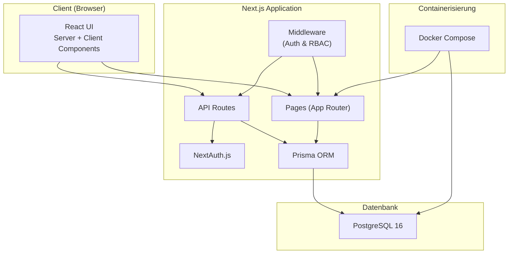
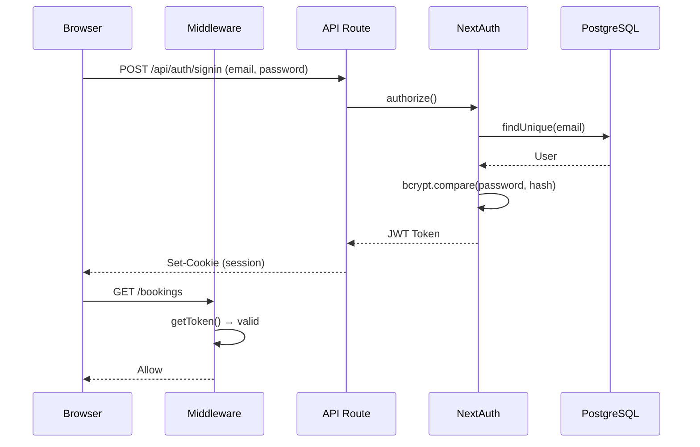
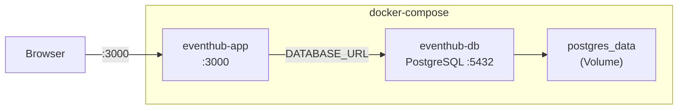

# Architektur-Dokumentation

## 1. Architekturübersicht

EventHub ist als **monolithische Full-Stack-Webanwendung** mit klarer Schichtentrennung konzipiert. Alle Funktionen teilen sich eine gemeinsame Codebasis und Datenbank.



## 2. Schichtenarchitektur

### 2.1 Präsentationsschicht (Frontend)

| Aspekt | Entscheidung |
|---|---|
| Framework | Next.js 14 mit App Router |
| Rendering | Server Components (Daten) + Client Components (Interaktion) |
| Styling | CSS Custom Properties + globale Klassen (kein CSS-Framework) |
| State | React `useState` / `useEffect` (kein globaler State Manager nötig) |

### 2.2 Geschäftslogik (API)

| Aspekt | Entscheidung |
|---|---|
| API-Stil | REST via Next.js API Routes (`/api/*`) |
| Auth | NextAuth.js v4 mit JWT-Sessions + Credentials Provider |
| Autorisierung | Middleware für Route Protection + API-seitige Rollenprüfung |
| Validierung | Serverseitig in API Routes |

### 2.3 Datenzugriffsschicht

| Aspekt | Entscheidung |
|---|---|
| ORM | Prisma mit Type-safe Client |
| Schema | Schema-as-Code in `prisma/schema.prisma` |
| Migrationen | Prisma Migrate |
| Konsistenz | Transaktionen + atomare Updates für Kapazität |

### 2.4 Datenbank

| Aspekt | Entscheidung |
|---|---|
| DBMS | PostgreSQL 16 |
| Grund | ACID-konform, ideal für Konsistenzanforderungen |
| Indexe | Auf Status, Kategorie, Datum, Foreign Keys |
| Constraints | Unique Constraints auf Email, Confirmation Code, Transaction ID |

## 3. Konsistenz-Sicherung

### 3.1 Überbuchungsschutz

Das kritischste Konsistenzproblem ist die gleichzeitige Buchung der letzten Plätze. Lösung:

```typescript
// Atomares Update mit bedingter WHERE-Klausel
const updated = await tx.event.updateMany({
  where: {
    id: eventId,
    ticketsSold: { lte: event.capacity - ticketCount },
  },
  data: {
    ticketsSold: { increment: ticketCount },
  },
});

// Wenn kein Update → Race Condition erkannt
if (updated.count === 0) {
  throw new Error("Kapazität nicht mehr verfügbar");
}
```

**Warum funktioniert das?**
- `updateMany` mit WHERE führt ein atomares `UPDATE ... WHERE` auf DB-Ebene aus
- PostgreSQL garantiert Serialisierbarkeit auf Zeilenebene
- Wenn zwei Requests gleichzeitig ankommen, gelingt nur einer

### 3.2 Transaktionen

Buchung + Zahlung werden als **eine Transaktion** behandelt:

```typescript
await prisma.$transaction(async (tx) => {
  // 1. Kapazität prüfen & dekrementieren
  // 2. Booking erstellen
  // 3. Payment erstellen
  // 4. Notification erstellen
  // → Alles oder nichts
});
```

### 3.3 Stornierung

Bei Stornierung wird die Kapazität **atomar zurückgegeben**:

```typescript
await tx.event.update({
  where: { id: booking.eventId },
  data: { ticketsSold: { decrement: booking.ticketCount } },
});
```

## 4. Authentifizierung & Autorisierung

### 4.1 Auth-Flow



### 4.2 Rollenmatrix

| Funktion | Besucher | Veranstalter | Admin |
|---|---|---|---|
| Events ansehen | ✅ | ✅ | ✅ |
| Events erstellen | ❌ | ✅ | ✅ |
| Events bearbeiten | ❌ | ✅ (eigene) | ✅ |
| Tickets buchen | ✅ | ❌ | ❌ |
| Buchungen einsehen | ✅ (eigene) | – | ✅ |
| Dashboard | ❌ | ✅ | ✅ |
| Nutzerverwaltung | ❌ | ❌ | ✅ |

## 5. Deployment

### 5.1 Docker-Architektur



### 5.2 Multi-Stage Dockerfile

1. **deps**: Installiert npm Packages + generiert Prisma Client
2. **builder**: Kompiliert Next.js (standalone output)
3. **runner**: Minimales Alpine-Image mit nur den nötigen Dateien

### 5.3 Entrypoint

Beim Start des Containers:
1. `prisma migrate deploy` → Datenbankschema anwenden
2. `prisma db seed` → Demo-Daten laden (falls leer)
3. `node server.js` → Next.js starten

## 6. Technologieentscheidungen

| Entscheidung | Begründung |
|---|---|
| **Next.js** statt separatem Frontend/Backend | Eine Codebasis, SSR, API Routes integriert |
| **Prisma** statt Raw SQL | Type-safety, Migrationen, Schema-as-Code |
| **PostgreSQL** statt SQLite/MySQL | ACID-Konformität, Robustheit bei Concurrent Access |
| **CSS Custom Properties** statt Tailwind | Kein Framework-Lock-in, volle Kontrolle |
| **Docker Compose** statt manuellem Setup | Ein-Befehl-Deployment, reproduzierbar |
| **JWT** statt Database Sessions | Stateless, kein Session-Store nötig |
